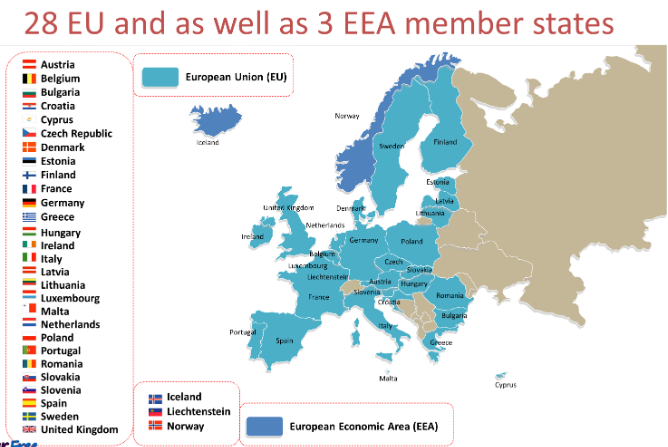
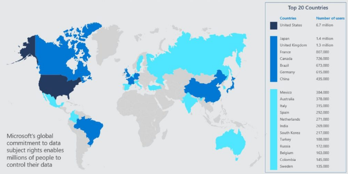
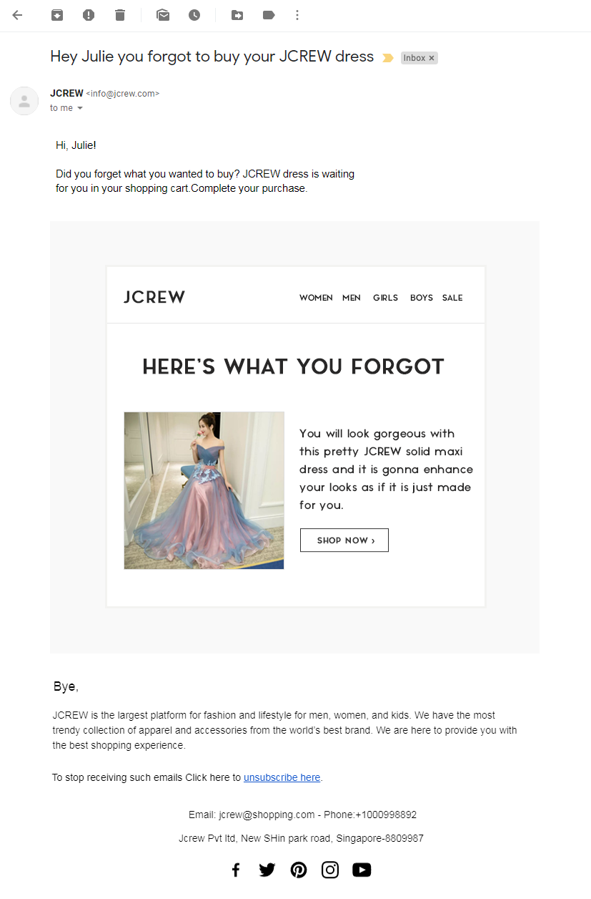

"Data is wealth, so is it okay to plunder it or play with it?"

  

Heated debates about the privacy, security, and legality associated with digital technology and data collection are gaining attention. This increased especially after the whistleblower Edward Snowden started becoming vocal about it.

  

In this wave, the eCommerce GDPR policy also got a wide range of attention and appreciation. eCommerce business nowadays involves a lot of data collection, storage, processing, and interpretation.

  

Though data is mainly collected with justified reasons like giving the customers a personalized experience and improving marketing tactics. Ultimately, this boils down to the data of individual persons and subsequently the question of cybersecurity arises. The EU countries have taken a serious step forward to address the same which encompasses strict regulations in the form of GDPR.

  

In addition to this sending email notification like abandoned cart recovery emails are an inevitable component of eCommerce marketing and remarketing. So, here is what you need to know and do to make your abandoned cart recovery process GDPR compliant.

  

**Disclaimer:** Please note that this is only information and you can read the <link-text url="https://www.i-scoop.eu/gdpr/" target="_blank" rel="noopener nofollow">GDPR regulations</link-text> and consult a legal attorney in order to get better guidance.

<toc>
</toc>

## What is GDPR regulation?

GDPR stands for General Data Protection Regulation. This applies to the jurisdictions which come under the European Union(EU) and European Economic Area(EEA).

  

This was formulated with an objective to increase the protection around handling private data. This became effective since May 15, 2018.

### Countries under GDPR regulation

 

  

### Should I follow GDPR if I am not from EU nations?

The answer to this is;

"Yes, you need to follow GDPR regulations if you aspire worldwide customers"

&

"No, it is not mandatory if you are never going to be associated with EU nations"

  

Still, it is recommended to be followed because GDPR regulations consider undeniable concerns in reality. Plus it is conceptualized for the betterment of data safety and privacy, which is a good start. And also, it got wide reception and      acceptance.

  
___

## Wide acceptance of GDPR

There is support from international bodies like "The European Consumer Organization". Public figures like Mark Zuckerberg and Richards Stallman, Edward Snowden started being proactive for the same.

  

Mark Zuckerberg stated  "Very positive step for the internet".

  

Further many countries got inspired by this and are implementing GDPR like regulations.

### Top 20 Countries under GDPR like regulations

 

---

## How GDPR can be applied to eCommerce websites?

When you run an online eCommerce business it is necessary to imbibe certain ethical practices especially while you are handling your customers’ personal data. GDPR regulations apply to the eCommerce business. Let us discuss some of the most important aspects that you need to follow in order to run a GDPR compliant eCommerce business.

  

Now, before getting into more details let us know certain terminologies which will be often mentioned.

  

**Data subjects** - are those individuals whose data is being collected.

**Legitimate interest** - showing voluntary interest by action.

### Quick eCommerce GDPR Checklist

1.  Email subscription should be optional and preferably with two-step confirmation
    
2.  Filter and update your mailing list
    
3.  Display age restriction for using your products
    
4.  Clearly mention the type of data you are going to collect and use
    
5.  Provide customers with ways to handle data related to them like access, requesting to erase, revoke consent and many more options.
    
6.  Communicate before 75 hours regarding data breach issues
    
7.  Get customer re-consent if in case you have updated your policies
    
8.  Make sure that the third-party apps that you are affiliated or partnered with also come under GDPR guidelines
    
9.  Whether you follow GDPR or any similar guidelines you need to mention a detailed outline in your eCommerce website.
    
10. Review your eCommerce <link-text url="https://www.campaignrabbit.com/blog/ecommerce-gdpr-checklist-an-ultimate-guide-to-digital-privacy-rules" rel="noopener" target="_blank">GDPR checklist</link-text> periodically by keeping yourself updated on the current trends, amendments and what experts do. 

In the wave of marketing automation, several online tools & apps started playing important roles. Among this, abandoned cart recovery email plugins are no exception. Moreover, those are the most widely used remarketing tools especially for cart recovery with consistent records indicating good sales conversion yields.

  

### What should I know before choosing an abandoned cart recovery plugin?

Sending abandoned cart recovery emails involves data collection.

So, before the recovery process, verify whether the planned method of data collection, processing, storage, and the email contents are GDPR compliant. And for the previously collected data, audit whether they come under compliance. You can verify this by considering the below factors.

  

**Consent**

As per the regulation, consent has to be informed and explicit. Having an already ticked checkbox with no option to untick is not considered to be explicit consent.

**Example of explicit consent**

Here in the below example, there is a clearcut Opt-in/Confirm my email address option. Further, you are free to Opt-out by not clicking the button with options to Opt-out later.

  

**GDPR compliant Cookies**

Cookies track user’s browsing activities. As it identifies individuals with their personal devices the concept of cookies itself is not considered to be GDPR compliant. Then how do more than 170000 websites use them?

The answer is the lawfulness is dependent on explicit consent.

  

 

In the above example, there is a message displayed that cookies are being collected on an <link-text url="https://ec.europa.eu/info/law/law-topic/data-protection/reform/rules-business-and-organisations/obligations/how-can-i-demonstrate-my-organisation-compliant-gdpr_en" rel="noopener nofollow" target="_blank">official website of the European Union.</link-text> Here you can either accept or decline and once accepted you can decline later and vice-versa.

This is how cookies survived the post-GDPR wave.

### GDPR compliant data collection?

Fetching data is unavoidable in today’s data-centric world. Well, you cannot improve, do research and rectify your mistakes without data. But what raises the concern is about the awareness and the consent. So it is recommended to do it in certain ethical ways as follows.

-   Explicit and informed consent
    
-   Information on data collection
    
-   Clear explanation about the purpose of data collection
    
-   Detailed data Privacy policy
  

### GDPR compliant data storage?

When data is collected with an enormous amount of effort it is inevitable that it has to be stored. But there have to be certain guidelines considering the safety concerning misuse of the same. Here are a few most common guidelines considering data storage.

-   Data Transparency in storage
    
-   Data Pseudonymization
    
-   Ensure safety with cloud-based third party storage
    
-   Data breach-proof
    

### GDPR compliant data processing?

Data processing is one of the key steps to be followed for data to be used in a meaningful way. This requires multiple hands like manpower, algorithms, statistics, and data sub-processing third-party software.

  

Below, there are the most critical processes for which safety has to be ensured before processing.

-   Data transfer
    
-   Data processing
    
-   Data subprocess
    
-   Data sharing
    

  
There has to be designated Data processing personnel to address and maintain data processing related safety guidelines.

### Rights that GDPR offers to its data subjects?

Pertaining to the collection of personal data GDPR extends a set of individual rights. Below mentioned are your rights being data subjects.

  

**Right to access -** This includes the rights of individuals to request how their data is being used and a copy of the same. This comes under Article 15.

  

**Right to data portability -** Individuals have the right to receive their data for using it somewhere else and this comes under Article 20.

**Right to rectification -** Individuals can request to modify or rectify their inaccurate data if they wish to do so which comes under Article 16.

**Right to be forgotten -** This includes the rights where individuals can request their data to be erased. This comes under Article 17 and can be requested to be fulfilled under certain circumstances like the ones mentioned below.

-   Data no longer required to be processed for the reason it was collected
    
-   Consent was revoked by the individual
    
-   Data was processed unlawfully
    

  

**Right to restriction of processing -** Individuals behold rights to restrict how their data is processed in certain circumstances and this comes under Article 18.

**Right to object -** Individuals have rights to object to the processing of their data in certain circumstances and it comes under Article 21.

**GDPR violation**

Any policy violation is finable and up to 20 million Euro or 4% of annual turnover, whichever is higher.

---

## GDPR compliant abandoned cart recovery plugin

So, as an example, we are going to discuss a GDPR compliant abandoned cart recovery email tool and list the features.

### Retainful

 

GDPR compliance of <link-text url="https://wordpress.org/plugins/retainful-next-order-coupon-for-woocommerce/" rel="noopener nofollow" target="_blank">Retainful</link-text> abandoned cart recovery tool mainly covers two important aspects.

-   **Data Controller -** The tool/plugin being GDPR compliant for its users. Here the tool becomes the data controller as it deals with user data such as your payment details, email addresses and so on.

-   **Data processor -** The tool handles information related to its user’s customers. This involves storing customer email addresses and email sending. So being a service provider it can assist GDPR compliant business.

Now, let us look into the details of Being GDPR as a data controller as well as a processor.

---

## As a Data Controller, how does the plugin comply with GDPR?

This relates to the data collected by a tool, such as a customer’s payment details and email addresses.

-   This plugin asks the user to enter their email ID. Here the customer is free to choose whether to give their email Id or not.
    
-   Email subscription is confirmed based on legitimate interest.
    
-   Indicates to the data subjects that data is being collected
    
-   Detailed the reasons for data collection
    
-   There is an option for unsubscribing email notifications
    
-   There is an option for unsubscribing email notifications
    
-   There are options to revoke consent
    
-   Remove customer data upon request
    
-   There is a clearcut detailed <link-text url="https://www.retainful.com/privacy-policy" rel="noopener" target="_blank">privacy policy</link-text>
    
---

## As Data Processor how do you stay GDPR compliant?

Here a merchant becomes a data controller for his/her customers. Hence beholding the responsibility to run a GDPR compliant business. Now, let us discuss the most important things you should pay attention to before you start your email remarketing.

  

### How to make your abandoned cart recovery emails GDPR compliant?

Generally, the concept of cart abandonment emails is considered to be in compliance with GDPR regulations. This is because your customers who are the data subjects have shown a legitimate interest in your business. This is very evident when they add the products you sell to their shopping carts.

  

Provided there is customer legitimate interest consent is not mandatory.

But before getting started, you have to carefully assess the <link-text url="https://techylearners.com/woocommerce-abandoned-cart-recovery-email/" rel="noopener nofollow" target="_blank">abandoned cart recovery process.</link-text> Ensure the non-violation of GDPR regulations. And follow a healthy data-related privacy policy. This is mainly because our necessities are going to extend beyond sending recovery emails.

  

### How to send a GDPR compliant email?

Before sending an abandoned cart email, it is always recommended to ensure its GDPR compliance by assessing the following aspects.

  

Opt-in- Explicit consent has to be taken from your customers by providing an opt-in for email subscription with options to decline the same.

  

Opt-out/Unsubscription- There must be options to opt-out of the email subscriptions in case of customers changing their minds later as well.

  

Email contents should be checked for GDPR compliance before sending it. The content of the emails should be relevant to the purpose of its collection with no illegal or irrelevant content.

  

Further, the email list should satisfy customer legitimate interest which should be periodically updated.

  

There should be a set of privacy statements mentioning what they intend to do with your data with a mention of its compliance with GDPR. There should be certain assurances regarding the safety of your personally identifiable information.  
  

You can demonstrate your GDPR compliance via abandoned cart recovery emails.

#### How to demonstrate GDPR compliance via email remarketing?

"We follow GDPR regulations" as a one-liner somewhere in the corner of your website is not enough. You need to work a bit to prove and convince your customers regarding this.

  

In the below example there is a privacy statement that links to the website’s GDPR page.

Below there are few other contents that you can add to your abandoned cart recovery emails to express your GDPR compliance. Some of which are mentioned below.

- Further, you can share the link of blogs, case studies social media posts, pages where you have discussed the importance of privacy and data safety. This will demonstrate your proactiveness ensuring GDPR compliance.
    
- And most importantly include contact details of active customer helpdesk to help them reach out for any queries and concerns regarding security, data safety, privacy, and GDPR.

## Conclusion

 

Here is good news that sending abandoned cart recovery email itself is not considered to be violating GDPR regulations. But make sure that certain steps and contents of your emails do not violate the same. Further, <link-text url="https://wordpress.org/plugins/retainful-next-order-coupon-for-woocommerce/" target="_blank" rel="noopener nofollow">abandoned cart recovery plugins</link-text> can make cart recovery more effective. Here you can choose the one that ensures that your cart recovery email marketing falls under GDPR guidelines.

  

One should not put someone’s personal information at stake for a dire desire to make a profit. There are 28+3(EU+EEA) countries that are under GDPR guidelines. In addition to this due to its worldwide acceptance, many non-EU countries are implementing GDPR like rules.

  

Do not forget to demonstrate your GDPR compliance to gain trust and support. This is absolutely necessary if you aspire to have worldwide customers or EU customers.

  

What all you think can add benefits to such rules and regulations? What are the problems faced while making your email marketing and data collection process GDPR compliant? Comment below.
