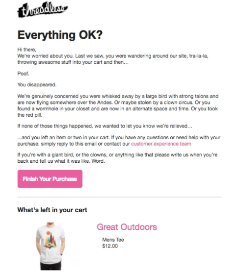
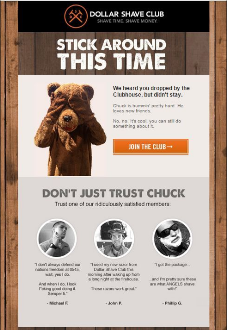
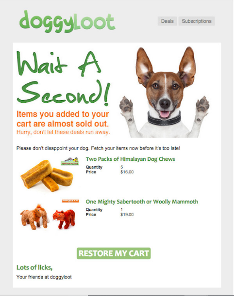
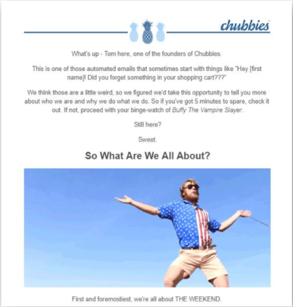
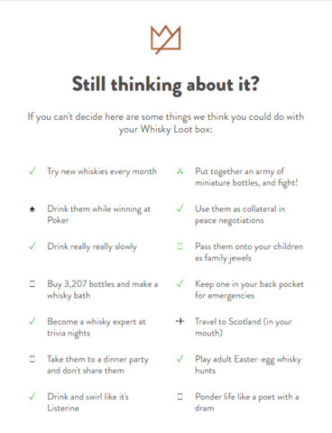
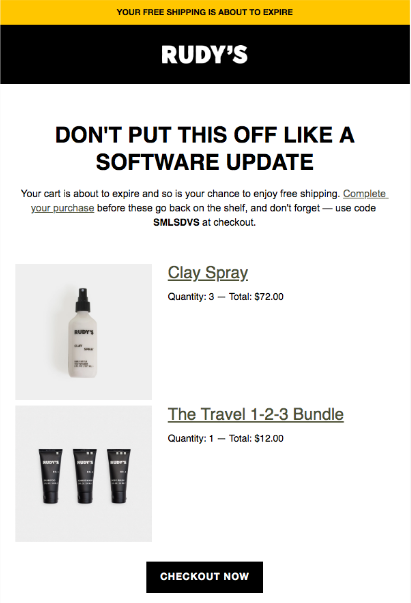
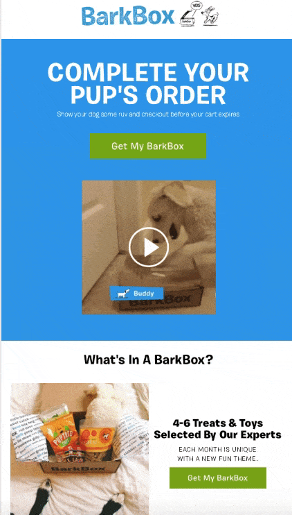

Two scenarios are presented here.

-   A student with a laptop, a table lamp, and a cup of coffee.
-   A laid-back student with a laptop, a table lamp, a cup of coffee, nachos strewn all over the place, donut cream around the mouth, and a wide grin while watching FRIENDS.    

Which one of the two appeals? Obviously, the second.

You visualize as you read and are able to decipher the humor involved. The thought about the first sentence fades away but the second stays.

Hence proven.

Using humor in marketing will have a lasting impact on the minds of the people.

<toc></toc>

## A brand that nailed humor in marketing…

 

DSC - Dollar Shave Club is out-of-the-world when it comes to using humor in marketing.

Michael Dubin, the Founder said in an interview to The Brave Ones, “I have always been a passionate student of comedy and writing and I still am today.”

Michael studied improv comedy while in his teens and it has helped him immensely to build the brand. A friend of Michael says that the company is an extension of himself.  

Check out this viral campaign for DSC.

 

<videoembed src="ZUG9qYTJMsI"></videoembed>

 

‘Our Blades Are F***ing Great’. This phrase is what made it popular. When others refrained from using it, Michael used it sensibly.

You will find other examples from Dollar Shave Club further down this page. Just keep reading.

In this post, the focus in on a specific type of marketing - cart abandonment emails. Learn the nuances of how to use humor in abandoned cart recovery emails.

But before that..

**A word of caution**

Some aspects need to be addressed before you take the plunge.

## Is humor right for your brand?

 

This is an example quoted by Matt Maggiacomo in one of his articles about <link-text url="https://jilt.com/blog/humor-email-marketing/" rel="noopener nofollow" target="_blank">using humor in email marketing.
</link-text>

A casket - if this is your product, is it possible to include humor when marketing it? That is a tough nut to crack. People will never take it positively when a loved one passes away. It is absurd to use humor here.

Similarly, check if humor can be incorporated into your brand.

**The way forward...**

Analyze the customers - are they people who might enjoy humor? This might not be possible if the overall outlook of your brand is serious and cater to such people only.

A green signal - Create few <link-text url="https://www.flycart.org/blog/woocommerce/how-to-customize-woocommerce-email-templates" rel="noopener" target="_blank">customized email templates
</link-text> for cart recovery.

Send them to one segment of your customer base.

Test the performance. Prefer A/B testing.

Bring about a big change to your brand.

A red signal - Take a detour and do what you are best at. Humor is not the only savior.

 

<download-cta url="https://app.retainful.com/register/" rel="noopener" target="_blank" buttontext="Try it Free">Start recovering abandoned carts & drive repeat sales.
</download-cta>

 

## Ways to use humor in abandoned cart recovery emails

 

This section is about 8 methods in which humor can be implemented practically into an abandoned cart email for Shopify or WooCommerce. Dive in.

### Start with the subject line

 

Are you on the hunt for <link-text url="https://www.retainful.com/blog/13-best-subject-lines-for-abandoned-cart-email-campaigns" rel="noopener" target="_blank">engaging subject lines
</link-text> Then, adding humor is the way to go.

Subject lines with humor stand apart from the others if done right. <link-text url="https://www.superoffice.com/blog/email-open-rates/" rel="noopener nofollow" target="_blank">47% of email recipients open an email based on the subject line.
</link-text>So, you understand the importance right?

Take a look at some examples.

Lemme Teleport You Back To Your Cart. Free Of Charge. - Chubbies

Do-be-do-be-do….Don’t keep you puppy waiting for his treats.

Knock Knock! Anyone in there?

Oh boy! Your cart is running away.

**Point to note**

-   Use informal language and be expressive

### Weave a story

 

Most people love to read. Probably, that is why you are doing it now. The elements that get a reader glued are many but there is one basic rule to abide by for a <link-text url="https://www.campaignrabbit.com/blog/7-abandoned-cart-recovery-email-ideas-for-shopify-and-woocommerce" rel="noopener" target="_blank">Shopify abandoned cart email.
</link-text>

Use a conversational tone. Period.

And conversational writing is made even more interesting when in the form of a story. Here is an example.

**Conversational tone**

Where were you all this while?

**Story**

We were worried about you. Last we saw, you were wandering around our site tra-la-la, throwing awesome stuff into your cart and then…

Poof.

You disappeared.

We’re genuinely concerned you were whisked away by a large bird with strong talons and now flying somewhere over the Andes. Or maybe stolen by a clown circus. Or you found a wormhole in your closed and are now in an alternate space and time. Or you took the red pill.

Interesting, right? You did have a hearty laugh. The credit goes to the team from Threadless. The complete email is given below.

**Points to note**

-   Use the reader as the protagonist of the story. In simple words, project the reader/email recipient as the central character and take him for a jolly ride with the abandoned cart email for Shopify.
-   Bring in emotions. This helps to develop a connection at a personal level.
-   Use a situation that is less likely to happen in a lifetime to create a story.

Take a look at this abandoned cart email from Ray-Ban which tells a story that is both aggressive yet evokes laughter.

Did you notice the copy?

Pry yourself loose, whack that bear in the nose (they hate that) and head back to Ray-Ban!

That is hilarious!

Ray-Ban has a suspicion that the reader is attacked by a bear when they find an abandoned cart. Really? The company takes it to the next level by giving a solution for it too.

Is this even possible? Well, maybe but the probability is one in a million.

### Use a mascot

 

The words ‘Disney’ and ‘Mickey Mouse’ are inseparable. With the mention of one, the other rushes into your mind. That is the power of advertising with a mascot.

The reach is wider and it gets straight into the minds of the public, making it unforgettable.

Do you have a mascot? Great. Bigger opportunities are coming your way.

Dollar Shave Club shows the best way to use a mascot in Shopify abandoned cart emails.

Here is Chuck, the mascot of DSC, waiting for you.

Seems Chuck wants to play peek-a-boo which is cute and appealing. Though ‘Chuck is bummin’ pretty hard’ to get back customers, the overall look of the abandoned cart email resonates humor on a light note.

No mascot? Then, the next idea is just right for you.

### Bring in a character

The possibilities of using humor in abandoned cart emails are not restricted to the content alone. Using character that brings a smile is a good strategy that can be implemented.

Dollar Shave Club uses the image of a baby to win back the customer.

I agree. This is not an abandoned cart email but does it matter here. We are talking about creating humor and this can be used without much change in a Shopify abandoned cart email too.

**Point to note**

-   Make it a point to make a reference to the character used in cart recovery emails when drafting the content. This ensures that the character is used with a purpose - to engage the email recipient, and not just out of thin air.

For example, in the above email, there is a sentence referring to the baby ‘P.S. Is it us, or does this kid look like Bruce Willis?’

Here is an abandoned cart email from Doggyloot that uses a character.

The cute dog in the email says ‘wait’ with a gesture that cannot be ignored. The very sight of this wins the readers’ hearts and encourages them to buy the abandoned product.

This email strikes the right chord because of the funny content too. Look at these lines.

Don’t let the deals run away.

Please don’t disappoint your dog.

Lots of licks.

All of the above lines are connected with the characteristics of the character - the dog. With this, the relationship is established between the character and the content which adds value for using the image.

### Self-criticize

If you are an ardent fan of Charlie Chaplin, you must have noticed one thing for sure. He criticizes himself for his actions through his comical act. On the receiving end, every gesture related to it turns out to be humorous. This is also called self-deprecating humor.

This strategy can be used effectively to create Shopify best abandoned cart emails.

Here is an example from Chubbies shorts.

The copy goes like this.

This is one of those automated emails that sometimes start with things like “Hey [first name]! Did you forget something in your shopping cart???”

We think those are a little weird. So we figured we’d take this opportunity to tell you more about who we are and why we do what we do.

Chubbies themselves feel that  <link-text url="https://www.campaignrabbit.com/docs/campaigns/how-campaigns-work" rel="noopener" target="_blank">sending automated emails
</link-text> all the time might not be a good idea. They criticize about it in the opening lines too. A change is brought about here. The complete email is about the company and their motto with just a CTA at the end to buy the abandoned products.

### Give out suggestions to use abandoned products

 

A normal suggestion for a bottle of whisky goes like this - Use them at a party and other auspicious occasions. Let your guests feel kingly.

Now, Whisky Loot turns it into - Take them to a dinner party and don’t share them.

This is what Whisky Loot has done in this abandoned cart email. They have listed out 14 hilarious ways to use the abandoned whisky box.

With this email, Whisky Loot has also marketed the product pretty well by saying ‘Travel to Scotland (in your mouth)’. It is a way of saying that the whisky is of Scottish taste and this makes the buy a compelling one.

### Connect to a real-life situation

Real-life situations are easy to relate for anybody, no matter what. Use them to compare with the process of cart abandonment or recovery.

The following snippets from abandoned cart emails prove that this is one of the easiest ways to bring in humour in emails.

Getting out of sand traps ain’t easy.

You know what is easy?

Completing your Chubbies order. - (Chubbies)

Chubbies considers cart recovery as a very tough task to be completed and compares it to an even tougher task in real life - escaping sand traps.

Don’t put this off like a software update. - (Rudy’s)

The human characteristic of procrastination is targeted in the above sentence and there is no better example than a software update. This sentence is used as the header in an abandoned cart recovery email by Rudy’s. You will never forget to laugh here.

 

### Use a video

If nothing works, the last and final resort is to add a funny video to the abandoned cart email.

The video must be as short as possible so that the customer resorts more time to complete the purchase. Here is an example from Barkbox. <link-text url="https://www.mailcharts.com/email-examples/671/cart-abandonment/d804e5e4-7a67-3fad-4f89-f9d87df5ca85" rel="noopener nofollow"  target="_blank">Click on this link</link-text> to see the video in motion.

 

The puppy can’t wait to have his share of treats for the month. Wouldn’t you buy the box when you come across a sight like this?

## To summarize…

Humor demands creativity, thinking wild, and out-of-the-box.

If you have this in possession, the road to success is yours in the field of email marketing.

Consider the following points when sending out funny abandoned cart recovery emails.

-   Keep the timing right.
-   Be a natural so that you don’t look like an attention seeker.
-   See to that the content is not offensive.
-   Hold your brand image high up in the sky.

Stop thinking and start doing it.

Good Luck!