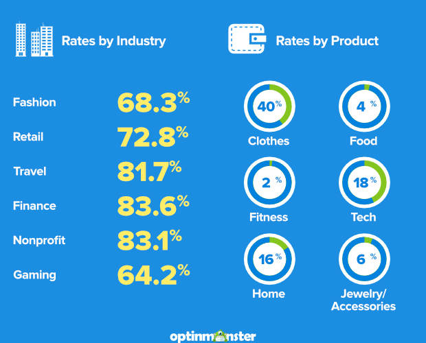
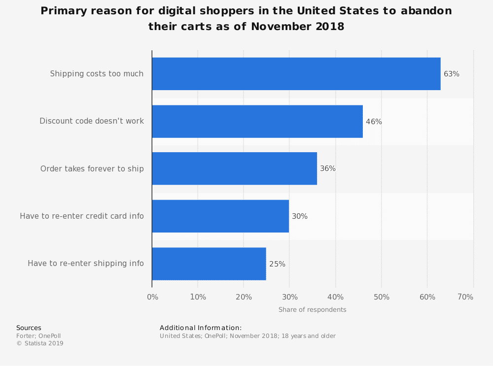
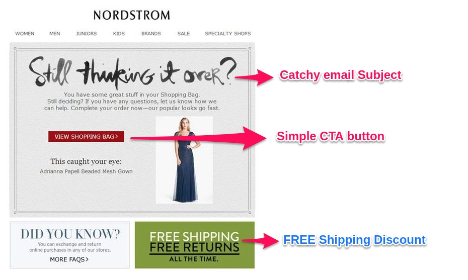

Let’s say Your WooCommerce store is running successfully with a healthy amount of traffic. And your online revenue is pretty solid as well. But still, there's a lot of sales left behind. In other words, you might still be facing huge number of lost sales.    

On an average, 60 - 80 percentage of your visitors exit the store without completing the purchase. The right term for this behaviour is called "Cart abandonment"

Here is a list of industry-wise cart abandonment rates

*Statistics By: Optinmonster*

### What if you can recover the abandoned carts?
____

70% is your abandoned cart rate. That’s more than “Two-third” of your sales volume remaining passive in the shopping carts.

Say, your store is making $1000 every month.
Speaking reality, let’s say you can recover at least 45% of your abandoned carts. Now, that’s an additional $900 added to your revenue. Almost double of what you are making.

Doing your Math?...
Don't worry! we have done the research for you and listed the best practices for writing effective copy for your abandoned cart recovery emails. Keep reading!

### Why you should send an abandoned cart email?
____

Let's first understand why email is the best strategy for recovering the abandoned carts.

Though there are a number of strategies avalable, <link-text url="https://www.campaignrabbit.com/blog/17-ways-to-increase-your-ecommerce-revenue-through-email-marketing" rel="noopener" target="_blank">email marketing</link> remains the No.1 tool for recovering carts among eCommerce marketers.

Abandoned cart emails are targetted emails sent to customers who have abandoned shopping carts without completing their purchase.

Unlike any other promotional campaigns, cart recovery emails have the best open rate of 46%. And, interestingly 35% of cart recovery email click drives customers back to your store and resulting in successful conversion.

### How to write effective abandoned cart emails that leads to conversion?
____

On an average, a person checks his emails at least 5 - 7 times a day. You probably are doing that already. But to make a customer click your cart recovery link requires you to write an engaging and effective email.

So, how to write actionable abandoned cart emails?... How to make your customer open and click the cart recovery link in the email?

Following are the best strategies followed by leading eCommerce brands in the world to write best abandoned cart emails (explained with examples). Feel free to borrow from the examples to write your own abandoned cart emails.

### What should be included in your cart recovery email? - Abandoned Cart Recovery Email Checklist
____

#### 1. Catchy Subject Line

We get hundreds of emails everyday. But we only open and read a few!. The top most factor that decides the open rate is: Subject line.
If you go with a generic subject line like “You Left Something in the Cart”, no one will be opening it. 
So, don’t send cart emails with subject line saying You left something..., Hurry..., You missed something… People are tired of seeing such patterns in email subject lines.

**Grab the attention with a compelling subject lines like:**

<callout>  
- We’ve Saved it for You!     
- Can We Help?      
- You got an Amazing sense of Fashion!
- Lemme Teleport You Back to Your Cart! Free of Charge!
</callout>

  
Well, look how caring ‘Casper’ has made the email subject line. “Come back to Bed” sounds caring and customers will certainly open it as it has an emotional connect.

#### 2. Show the customer what’s left in the cart

Well, you can absolutely track and <link-text url="https://www.retainful.com/blog/how-to-check-abandoned-carts-in-woocommerce" target="_blank" rel="noopener">check abandoned carts in your WooCommerce</link-text> store. But your customer may not actually remember what’s left in the cart.

So, make sure your cart recovery email reminds customer of what’s left in the cart. Showing the abandoned cart items should be the primary content in any abandoned cart email.

Look how ‘Ashford’ effectively used the email space to show the abandoned cart item. It’s obvious that this part showing the abandoned cart items gets the maximum customer attention. 
 

#### 3. Single-click cart recovery (Call to action button)

Let the customer recover their cart with a single click and take them back straight to their cart. This helps the customer complete the purchase more quickly. 

If you are taking them through a complex checkout process with multiple steps, there are chances that the customer might get distracted and will not complete his purchase. So ensure a distraction-free, single click recovery. And make sure you include that recovery link in the email follow-up.

 

 

  ‘Michael Stars’ adds only two Call to action buttons in the above cart recovery email.
-   Return to your cart- to take customers to the cart page so that he can add or remove products before checking out.
-   Checkout Now- to take customers directly to the checkout page where the customer is just asked to complete payment.
  
#### 4. Tempt with discounts & Free Shipping

Ever asked customers the reason for cart abandonment?
Well, here’s what Statista has got to say when it comes to Why People abandon shopping carts.  
You can clearly see that the majority of people abandon shopping cart when they get no coupon discounts and see high shipping charges on the checkout page.

  

*Statistics By- Statista*

So, what if the customers are shared with FREE shipping coupons and discount offers along with the cart recovery emails? In this case, you are providing a valuable solution for your customers to recover abandoned carts.

‘Nordstorm’ had done a clean cart recovery email copy & makes pretty sure that the free shipping discount is highlighted (Green Text box).

#### 5. Share Support Details

Sometimes your customer might have few queries regarding the product delivery, return policy, coupon restrictions, etc. and because of that could have abandoned cart.

In this case, you got to make sure that every query of your customer is answered. And that’s done by sharing the support details in the WooCommerce abandoned cart email.

I guess ‘Poppin’ is pretty obsessed to offer excellent customer support. Look how casual they write the support column in their cart email. Also, the support details they share shouldn’t be missed reading- it includes the support number, support availability (work timing), and email address to send feedback.

Complete. Isn’t it?

#### 6. Add Customer reviews

Online shoppers are always obsessed with social proof. They look for product reviews before making an online purchase.

And when a business shares social proof (customer reviews and testimonials), the credibility on the product and the trust in the company grows tall. In fact, Social Proofing is one among the list of [17 Growth hacks to grow online business](https://www.campaignrabbit.com/blog/how-to-easily-to-grow-your-online-business-17-growth-hacks).

Its ‘Casper’ again.

They write solid abandoned cart recovery email.
-   Engaging email subject line
-   Simple call-to-action button and,
-   Social Proofing- Sharing customer testimonial.

Customer testimonials in cart recovery email can offer the best reason for customers to recover abandoned carts.

### Final Thoughts
____

Customers abandon the cart for variety of reasons. With a proper follow-up and reminders, it is possible to recover at least 30 to 40 percentage of lost sales.

And it is now easy to do this in your WooCommerce store by using Retainful. <link-text url="https://www.retainful.com/features/woocommerce">Get started with Retainful for free</link-text> and start receovering the abandoned checkouts. 

<link-text url="https://www.retainful.com/features/woocommerce">Download Retainful for FREE!</link-text>
