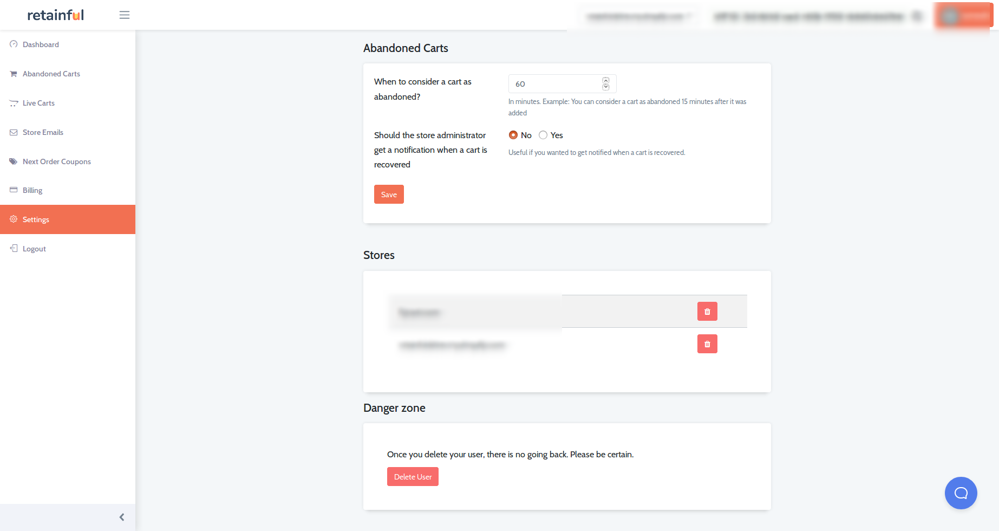
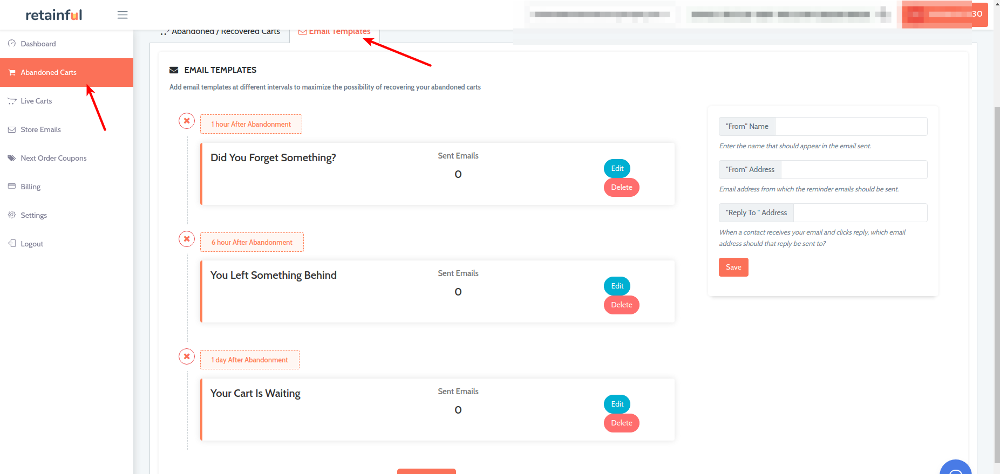
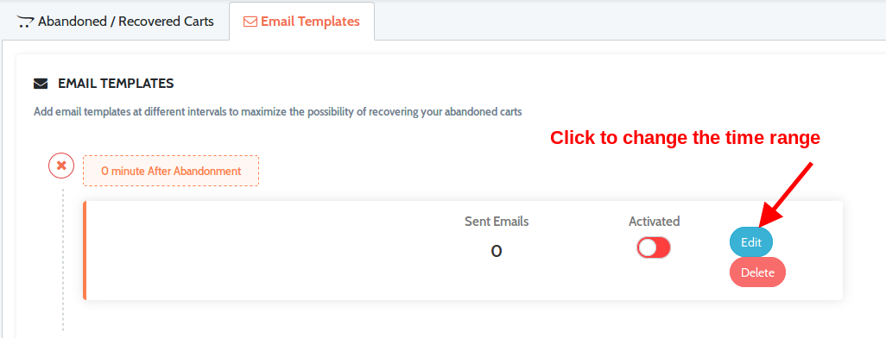
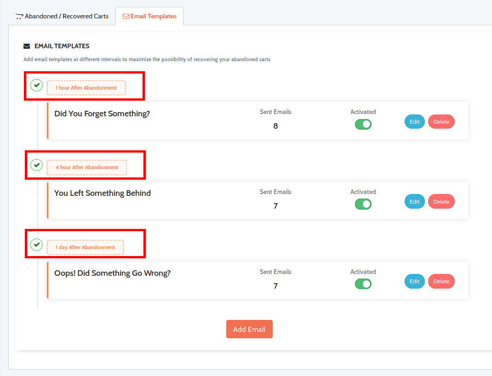
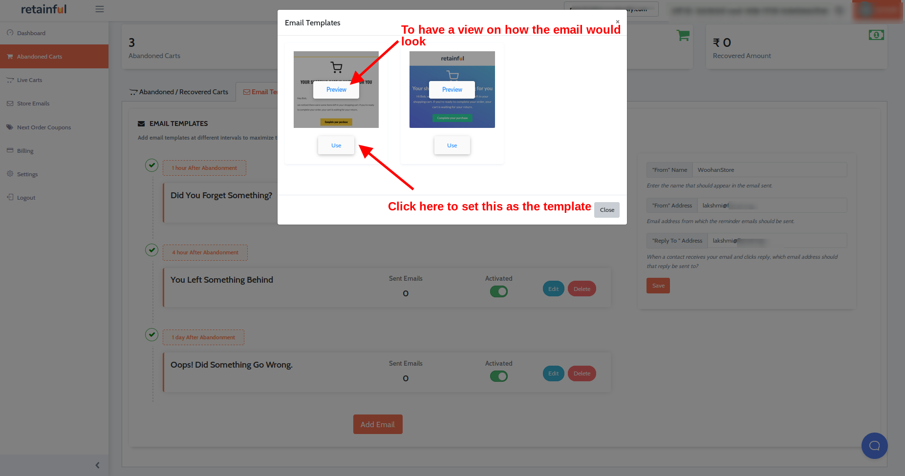
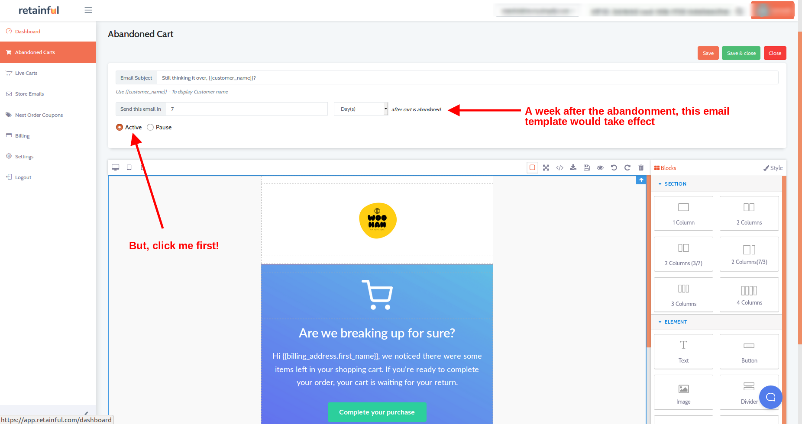
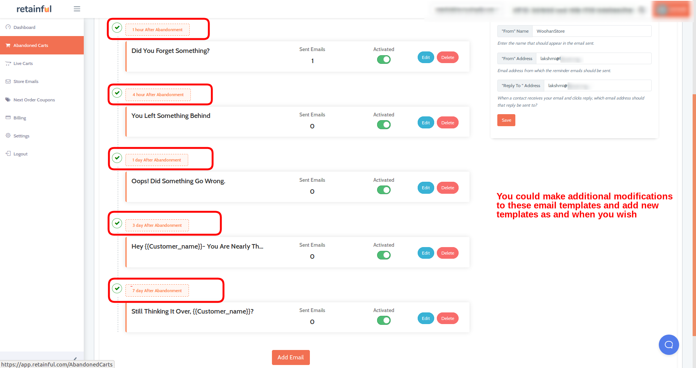

### Introduction

In this article, let us focus on the following topics:
1. What is an abandoned cart email?
2. Why your site should send abandoned cart recovery emails?
3. Setting up abandoned cart emails using Retainful
4. Reports and recovery of abandoned carts     

### **What is an abandoned cart email?**

An abandoned cart email is a reminder or follow-up email sent to prospective users who have added products to their cart but left the store without completing their purchase.

### **Why your store should send abandoned cart recovery emails**

In the Ecommerce world, the rate of cart abandonment is increasing day-by-day. Here is why you should abandoned cart emails to recover lost sales.
Consider the following statistics:

- 45% of all cart abandonment emails are opened
- 21% of all cart abandonment emails are clicked
- 50% of those clicks lead to a recovered purchase back on site

Motivating, isn't it? 
Let us now learn how to set up abandoned cart email sequences with Retainful.

### Basic settings

Before we hop on to the email configuration, let us look at the pre-requisite parameters that have to be tweaked. To do this, you can follow the below steps:

- Login to your <link-text url="https://app.retainful.com/" target="_blank" rel="noopener">Retainful dashboard</link-text>
- Once you login to the dashboard, click on the **Settings** tab. Scroll down to the **Abandoned carts** part.

#### **When to consider a cart as abandoned**
  The time mentioned in this option is the limit after which the user's cart would be considered abandoned.
  For example, you mention 60 minutes here. Then  when a user adds a product to the cart and doesn't checkout. The system would wait until 60 minutes and then mark the cart as abandoned cart.
  
 #### **Should the store administrator get a notification when a cart is recovered**
  If you set this option to Yes, then the store administrator would be notified each and every time a cart is recovered.
  
- Save the settings once you have mentioned the necessary requirements.

3) Navigate to the Abandoned carts tab. 
4) On the right corner, mention the From name, From address and the Reply to address as indicated below:

NOTE: If you have not mentioned any from email, to email in the above fields, then Retainful would use the Email address used associated with your Retainful account.

### Email sequence scenario

Let us consider the following email sequence:

* Send a follow-up after 1 hour of abandonment
* Another reminder after 4 hours after abandonment
* Yet another email after 24 hours after abandonment

### Methods of creating abandoned cart email sequence

There are two methods through which you could create abandoned cart email sequences:
	       
* Using the pre-defined template sequence
* Setting up new email template sequence

### Using the pre-defined templates

To help you save time and set up beautifully crafted abandoned cart emails, Retainful offers built-in templates which you could use to set up a abandoned cart email sequence. Here you could either use the same settings of the templates or carry out minor tweaks such as adjusting the time range in which the sequence is sent, the subject line and so on.

**Steps to be followed**
1) Navigate to the **Abandoned carts** section on your Retainful dashboard.
2) Click on the Email templates. You could see the default email sequence.

Let us consider the email sequence we mentioned in the previous section. It is a 3 mail series. Let us learn how we could modify the default email templates.

3) Click on the Edit option next to the Email sequence template.

4) You could mention the time range here. Also, if you wish to change the subject line and so on, you could do so.

5) Similarly, after editing and activating the other two email templates, you should find the dashboard like this:

Once the series is set up, Retainful would send automated, pre-designed abandoned cart emails as per the configuration.

### Setting up a new email sequence

The above method of using the in-built sequence would hold ideal if you have a simple abandoned cart recovery email series.
If you wish to increase the frequency of recovery emails, then you could do so by creating new email templates in addition to the above pre-defined series.

#### Scenario

Let us assume the following scenario:
* Send an email 1 hour after abandonment.
* A reminder 4 hours after abandonment.
* One more follow-up after 1 day of abandonment.
* Yet another subtle reminder 3 days after abandonment.
* Still no attention? Send another email after a week.

#### Steps to be followed
1) We already have the first 3 email templates as part of the default email template series.
2) Now, let us use the **Add email** option at the bottom of the Abandoned cart email templates section to create as many templates as we wish.

3) Once you click on the Add email button, a pop up would show up where you could choose the email template for the email template that you are now going to create and view a preview of the email template.

4) Once you click on the **Use** button, you will be redirected to a page where you would be able to mention the time frame and subject line of the email. If you wish, you could make additional email layout customisations as well.

5) Repeat the same process for the email template that should be sent after a week.

6) Now the email sequence would look as follows:

Hurray! We have set up an email template sequence.
Retainful would send automated, timed recovery emails when a user abandons his/her cart.
Emails would be sent until a customer recovers the cart. The time interval between the email sequence can be modified as per your requirements.

### **How to check abandoned carts and recovered carts**

Retainful offers a real-time monitoring and complete analysis of abandoned carts and recovered carts. One can view these reports in the dashboard of his/her Retainful dashboard under the **Abandoned carts section**.

**An overview of abandonments and conversions**

You could find the following information here:

1) Number of abandoned carts
2) Amount abandoned
3) Number of carts recovered
4) Amount recovered

**More information on abandoned carts and conversions**

This section offers a bit more information about the abandonments and conversions. You could find the following information here:

1) Status of the carts
2) User information
3) Cart value
4) Items in the cart
5) Additional filters to sort and refine the data

While clicking on the view icon, the user's cart information pops up like this:

### Support

Having queries?
Please dab the chat icon at the right bottom corner. One of our support staffs would help you through.
