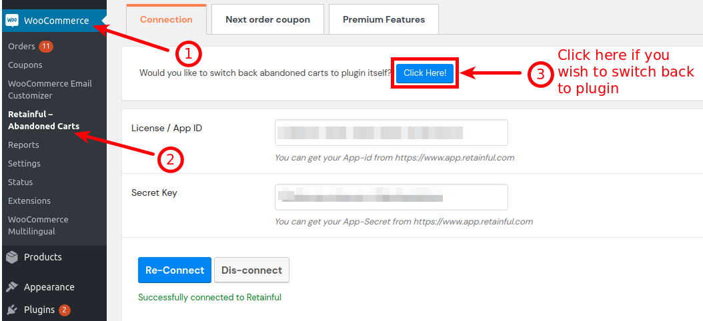

### Why should I migrate to cloud

 When you are using the Retainful plugin with version 1.x, the abandoned carts management is handled via the wordpress scheduler. All the abandoned cart, recovered cart and in-progress cart entries would be listed on your site's Retainful plugin dashboard. Also, all the mail management occurs within your site. 

While on the other hand, if you migrate to the cloud(option available for existing users if you update the plugin from version 1.x to 2.x), the cart and mail management would be done in the Retainful account dashboard and not on your site. 
So, this would improve the mail handling process significantly. Since we move all the mail handling to the cloud, the site's resources would not be occupied, which would save database space occupancy, thus increasing your site's speed.

### Points to be noted before migration

- [x] 1. The migration option would only be available for users that update the Retainful plugin from version 1.x to 2.x.
- [x] 2. If the version of Retainful plugin you are using is 2.x, then the cart and mail management would automatically be done via cloud. That is, the cart entries and mail templates would be available in your Retainful account and not on your site.
- [x] 3. Once you migrate to cloud, the upcoming abandoned carts, in-progress carts and recovered carts would be recorded and managed in your Retainful account only. Only the Next order coupons and premium features would be listed on the plugin on your site's backend.

### Prerequisites

While using Retainful 2.x, the mail delivery is done with encryption, for security purposes. So, please make sure that your site's server has encryption library enabled.

### Migration from version 1.x to 2.x

**Step-1: Upgrading from version 1.x to 2.x:** 

The migration option would be available if you update from Retainful version 1.x to 2.x as mentioned before. Hence, the first step is to update the plugin version from 1.x to 2.x

1. A one-click update option would be available on your store's plugin manager if you have connected the store with your Retainful plugin. If you haven't connected the store with your account yet, you could do so by clicking <link-text url="" target="_blank" rel="noopener">here<link-text>.
2.  Once you connect the store with Retainful account, navigate to your Plugin manager(Woocommerce->Plugins->Installed plugins). You would find an update button below Retainful- Abandoned carts as shown below:
 
    
3. Click on the Update button to Update the plugin to version 2.0. A success message appears post update like this:

    
> NOTE: For new users, you could install the plugin straight away and all the data would be maintained on cloud. To learn how to install the plugin, click <link-text url="https://www.retainful.com/docs/woocommerce/install-retainful-plugin-for-woocommerce" target="_blank" rel="noopener">here</link-text>   

**Step-2: Migrating to cloud:**
    
1. Now that you have updated to 2.x, a button would appear at the Retainful page on your site.
    
    
2. Clicking on the button would move all the upcoming abandoned cart, in-progress carts and recovered cart entries to the Retainful account. Make sure that you have <link-text url="https://www.retainful.com/docs/woocommerce/connecting%20the%20store%20with%20retainful%20account" target="_blank" rel="noopener">connected the store with your Retainful account</link-text>.
   
3. As far as Abandoned cart email templates are concerned, you will have to set up a series of new ones in your Retainful account, so that the users who abandon carts after migration would get notified.

**Step-3: Post migrating to cloud:**
    
  1. As mentioned before, after you migrate to cloud, there has to be an abandoned cart email sequence maintained on the Retainful account as well. There would be a default set of templates on the Account. You could use these templates or create a new email sequence as per your requirements.

  **Step-4: Switching back to plugin:**  
    
    If you change your mind after migrating to cloud, you still have the option to switch back to plugin.
    
1.  After migration, the Abandoned carts, Sent emails and the Email templates are separately managed on the connected Retainful account. This is how your Retainful plugin page would look after migration:

 
    
 2. If you wish to switch back to plugin itself, you can click on the above indicated button. If you switch back from cloud to plugin, the upcoming abandoned carts, live carts would be maintained in the plugin itself.

 3. Those entries that were recorded after migrating to cloud before switching back to plugin, would still be maintained on your Retainful account.

  ### Summary
    In this article, we saw how to:
1.  Update the Retainful plugin
2.  Migrate the entries to cloud
3.  Switch back to plugin