Encourage your customers to buy more by providing offer codes to their next purchase.

Give them with dynamically generated coupon codes while a customer places an order along with the order notification email.

Retainful - Next order coupons will let you to send offers included with the coupon codes within minutes of configuration.

Let us see, how that works.

### Setting up next order coupons

Navigate to **Woocommerce->Retainful- Abandoned carts->Next order coupon**.

### Basic settings

 Enable next order coupon and set up the **coupon value** in the basic settings here. 

**Order status and user role**

Order status and user role based coupon generation is also possible. Choose the desired order status and user role. The default setting is **All**.

**Coupon Type and Value:**  

You can provide a Percentage off on their Next purchase or a Flat price discount in the cart with a coupon value as per your requirement 

Example:  15% discount on the cart.

**Apply coupon to:**

This setting is to validate the coupon code to be applied only when a customer logged or to be validated in the checkout or do not validate.

- Allow anyone to apply coupon - Do not validate the coupon if used my a customer.
- Allow the customer to apply but validate at checkout - Coupon will be applied but the user will be validated at the checkout as user might not login until checkout
- Allow customer to apply coupon only after login

 **Allow next order coupons for orders created in the back end and also for old orders (when re-sending the email notification):**

By enabling this option, now you could send next order coupons for existing orders and new orders created from your back end also.

For more information on how to set up next order coupons for existing orders and
new orders from back end, click <link-text url="https://www.retainful.com/docs/woocommerce/testing-next-order-coupons/#from-store-admins-backend" rel="noopener">here</link-text>.

**Show next order coupon in order "Thank you" page?:**

Setting this option to Yes would show up a dynamically generated next order coupon at the thank you page of your store front. 

**How users view it on the thank you page**

Post enabling the above setting, Just place a test order on the storefront to see the coupon being displayed at the end of order completion.

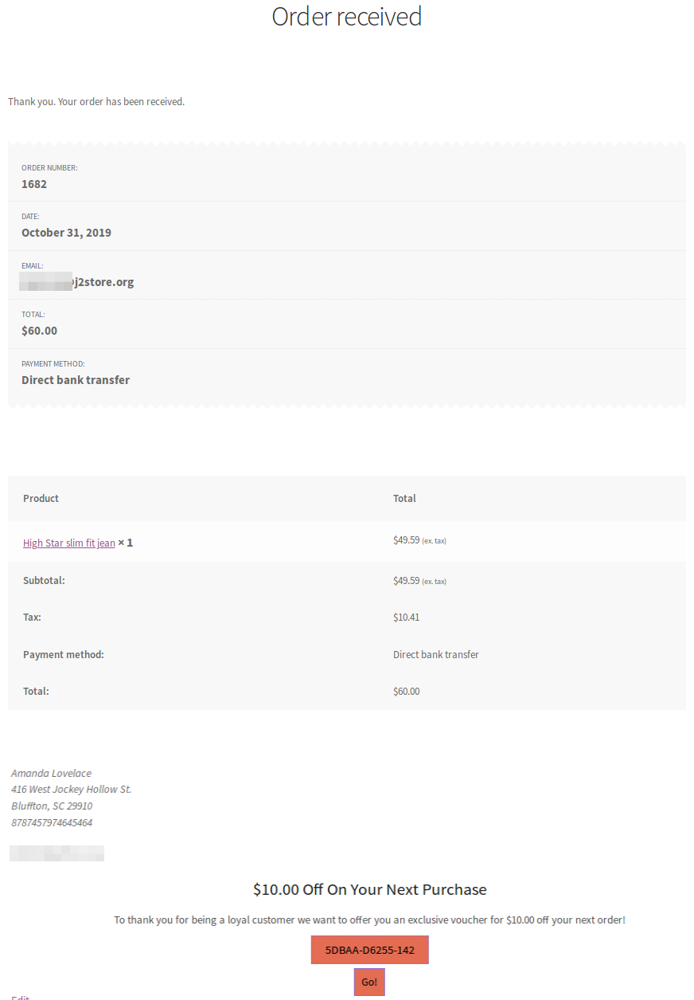

Additionally, the coupon code would also be attached to the order notification email as well.

**Video Tutorial**

Here is a video on displaying a coupon code at the thank you page:

<iframe src="https://www.loom.com/embed/0dfc02fed74a474fb4f9404f6a4e737c" frameborder="0" webkitallowfullscreen mozallowfullscreen allowfullscreen style="position: absolute; top: 0; left: 0; width: 100%; height: 100%;"></iframe>

**Display coupon message after:**

You can choose where the coupon has to be displayed in the email.

- After Customer Details
- After Order details
- After Order meta

Choose it as per your requirement to display the coupon code.

Let us now create the custom coupon message to be displayed.

**Custom Coupon Message:**

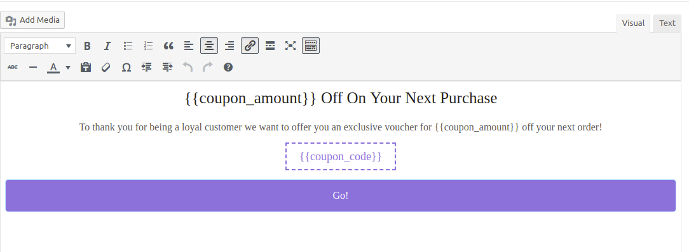

Use the below short code to customize the coupon message with dynamic data:

**{{coupon_code}}** - Coupon code
**{{coupon_amount}}** - Coupon amount
**{{coupon_url}}** - Url to apply coupon automatically
**{{coupon_expiry_date}}** - Coupon expiry date(If coupon does not have any expiry days,then this will not attach to the message).

### Restrict coupon generation by setting up conditions

To set up conditions for coupon code generation, scroll to the **Coupon Generation Restriction** heading. You can restrict the generation of Next order coupons based on:
  
  - Order status
  - User role
  - Products 
  - Categories

You could also set the number of coupons that a particular user is eligible for.

### Usage Restriction

Restrict the usage of the coupon in various ways.

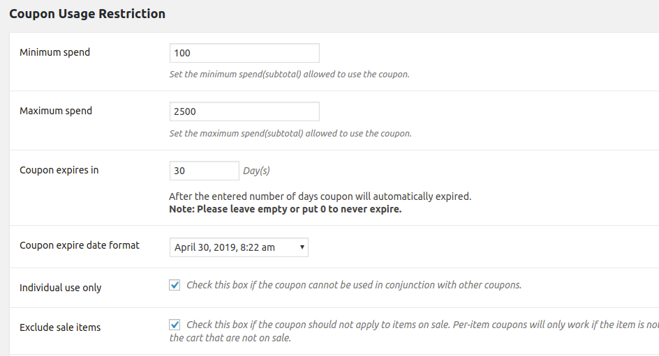

**Minimum Spend:**  Set the minimum spend(subtotal) allowed to use the coupon.

**Maximum Spend:** Set the maximum spend(subtotal) allowed to use the coupon.

**Coupon expires in :** After the entered number of days coupon will automatically expired.
Note: Please leave empty or put 0 to never expire.

**Coupon expire date format:** Select a date format from the dropdown.

**Individual use only:**  You can check this if you want this coupon to be used separately alone.

**Exclude sale items :**  Check this box if you want this coupon not to be applied on sale items.

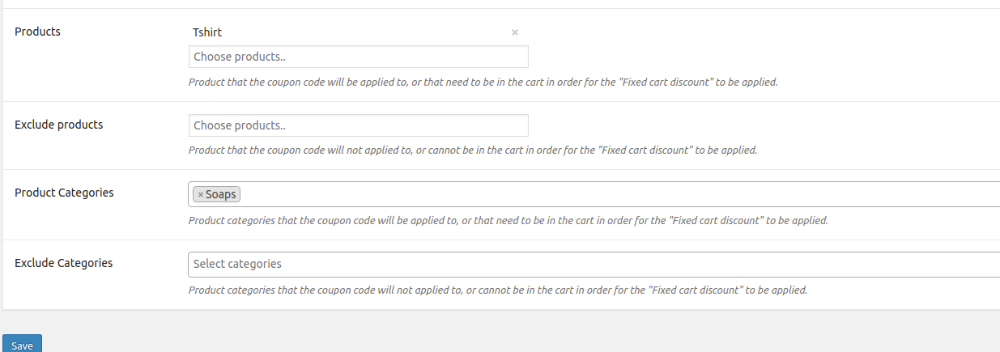

You can also restrict the coupon in much more options like only for applying to certain products or only to categories.

You can also Exclude some products or categories from the discount coupon to be applied.

### Coupon applied response message

You can display a popup indicating the application of the coupon while users redeem their next order coupons. This popup would appear when users click the GO button below the coupon code on their order notifications.

To display the popup while users redeem their next order coupons, set the option Enable response popup to Yes.

You could even customize the text that appears on the popup in the message box available. As part of customization, you could include dynamic data by using shortcodes listed below the coupon popup message box.

We have completed the setting now.

### How users view the next order coupon

Let us see, how it looks in the emails as per the settings provided.

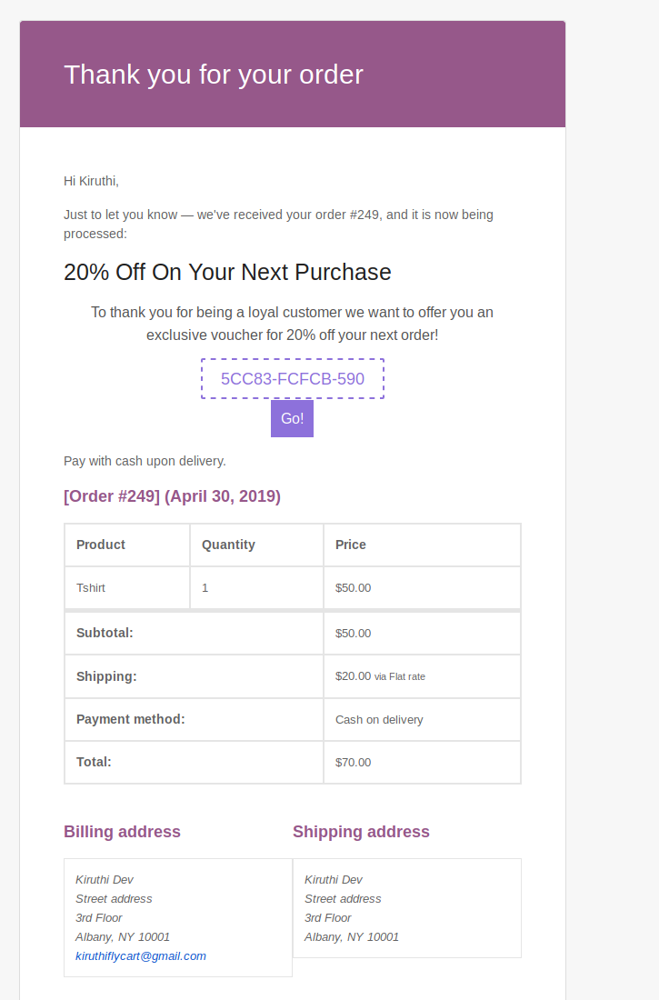

Cool, isn’t it !! 
Users can redeem their coupons by just clicking on the **Go** button below the coupon code.

### Test your next order coupons
Sometimes, you might wish to reward users with Next order coupons. So, it becomes necessary to know how the coupons work. 
Let's do some testing to understand the workflow.

#### Receiving next order coupons:

Next order coupons can be received in two methods:
1) Placing a test order from the storefront
2) From the store's admin panel:
         -  **Sending an order notification from the existing orders**
         -  **Creating new orders from the backend**
        

#### Placing a test order from the storefront

1) You could set up a next order coupon on your store by following the guide <link-text url="https://www.retainful.com/docs/woocommerce/next-order-coupon" target="_blank" rel="noopener">here</link-text>
2) Once you have set up a next order coupon, navigate to the shop page of your site, add an item to the cart.

3) Navigate to the cart page by clicking on the **view cart** button.
4) In the cart page, click on the proceed to checkout button to move to the checkout page.
5) Fill in the details at the checkout page, choose the desired payment method and click on the **Place order** button.

1) You would be redirected to the order confirmation page where a success message would appear as follows:

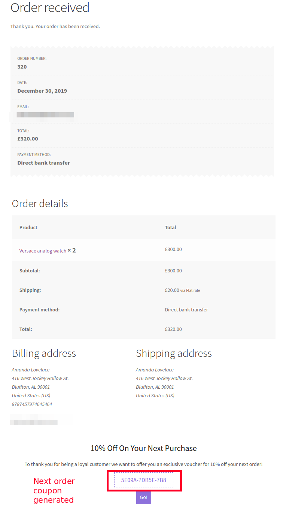

1) An order confirmation email is sent to the email address associated with the order.

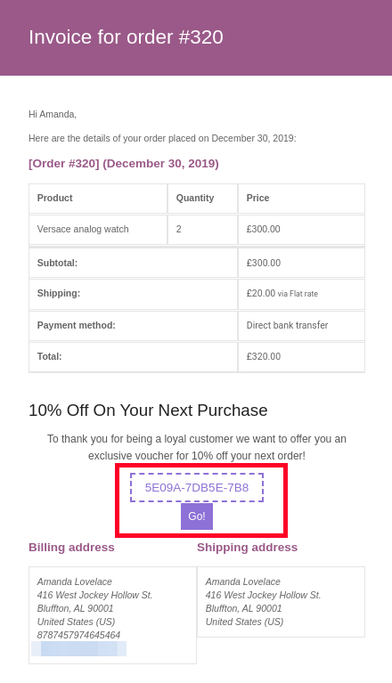

#### From store admin's backend

There is another provision to receive the next order coupons by creating new orders from the backend or by sending email notifications from existing orders. 

##### Settings

1) Login to your store's admin panel. Click on  Woocommerce->Retainful-Abandoned carts->Next order coupons tab.

2) Set the option  **Allow next order coupons for orders created in the backend and also for old orders (when resending the email notification** to Yes.

Setting this option to Yes would allow you to resend next order coupons from your admin panel for orders that have been created already or orders that are created from the backend.
The emails would be sent to the email associated with the particular order.

#### Creating an order from admin panel

1) Login to your site's admin panel. Navigate to Woocommerce->Orders->Add new.

2) Fill the details, choose the payment method, add product(s).

3) At the far right corner, in the order actions field, choose the option **Email invoice/order details to customer** option.

4) Once the option is chosen, click on the arrow button next to the choose action dropdown box as shown in the above screenshot.

5) An email would be sent to the email associated with this order with the next order coupon details.

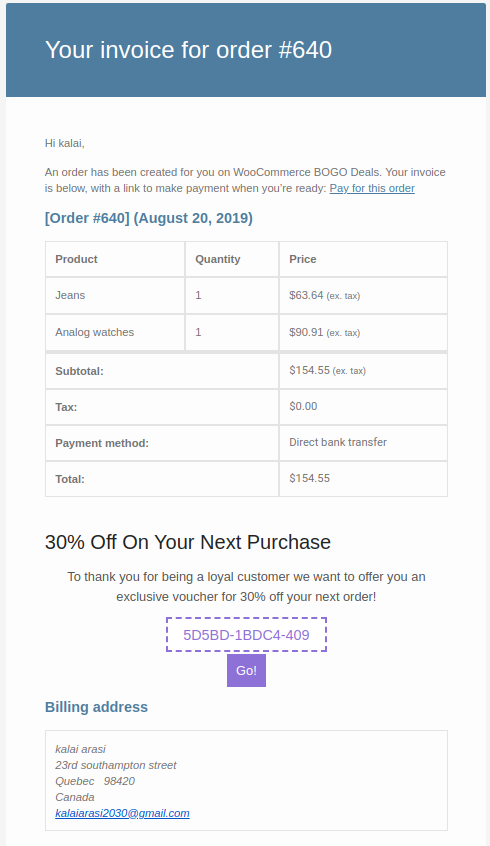

### Sending next order coupons for existing orders
1) Login to your store's admin panel. Click on Woocommerce->Orders->Choose an existing order.

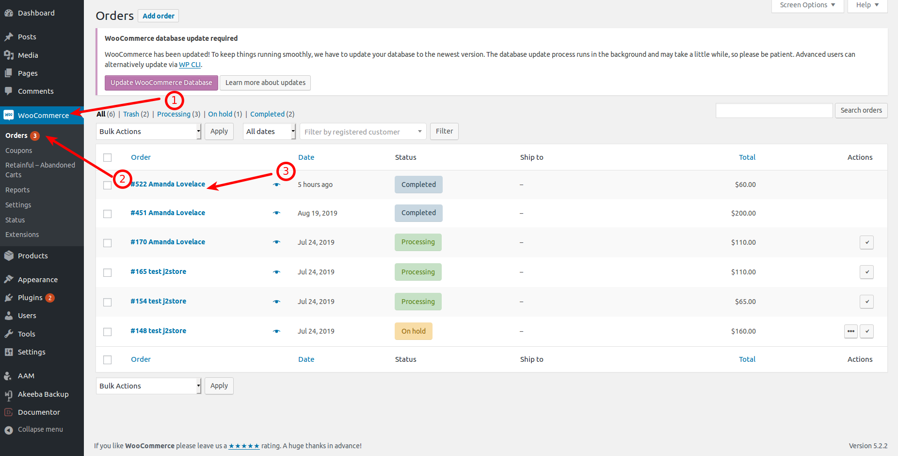

2) At the far right corner of the order view page, click on the option **Email invoice/order details to customer** option.

3) Once the option is chosen, click on the arrow button next to the choose action dropdown box as shown in the above screenshot.
4) An email would be sent to the email associated with this order with the next order coupon details.

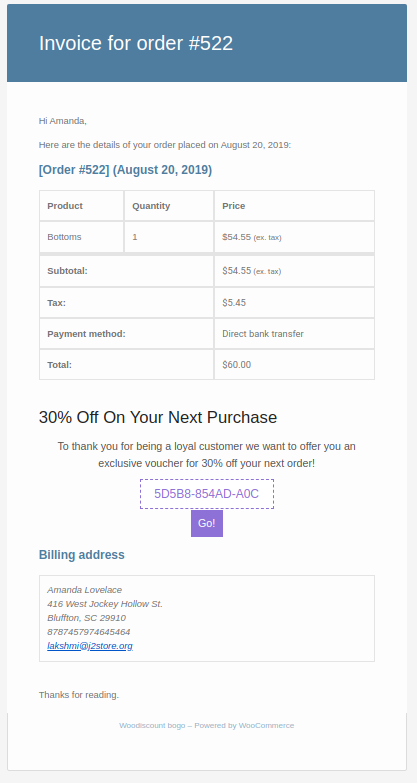

#### Testing next order coupons

1. Now that you have received the order notification email, for example, let us consider the following email:

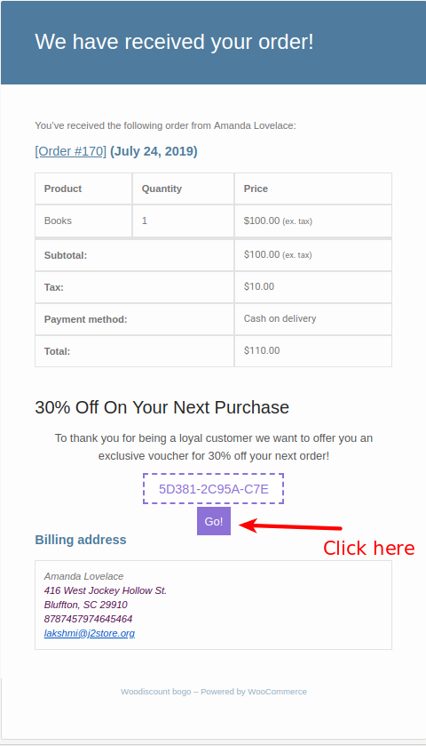
2. Click on the **GO** button on that email.

3. Add a product to the cart and click on the view cart button.

4. Once you visit the cart page, the coupon would be applied based on the restrictions and configuration set at the Retainful plugin.

Tada! The coupon has been applied.
